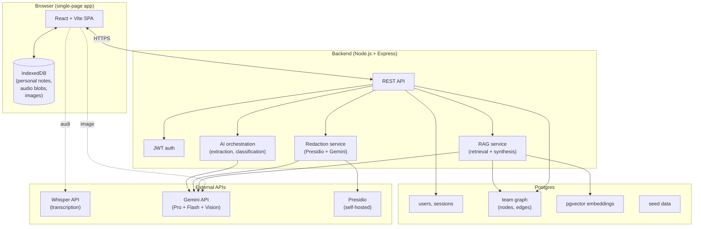
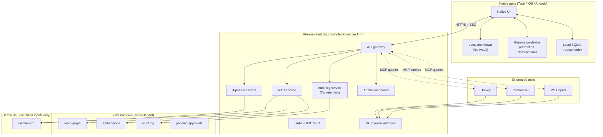
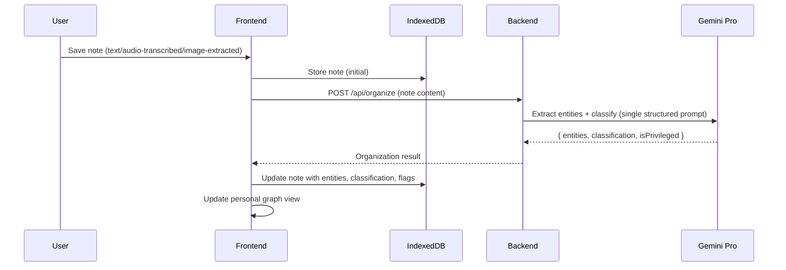
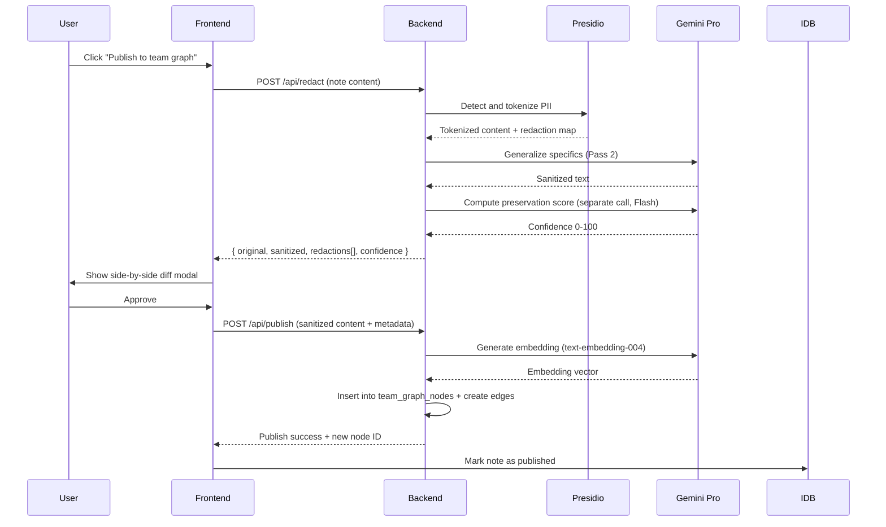
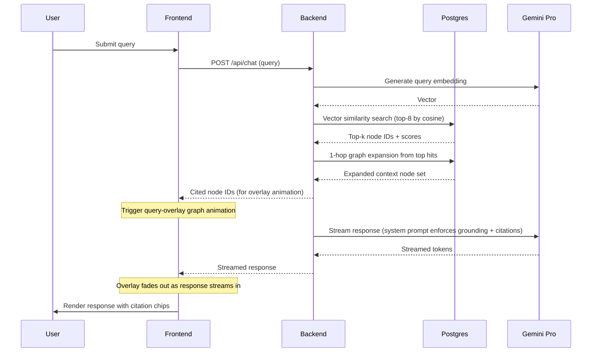

# Trellis · Project Architecture

**Document type:** Project Architecture
**Audience:** Engineers building Trellis
**Status:** v1 · Hackathon stage
**Companion documents:** `product-brief.md`, `product-requirements.md`, `design-guidelines.md`

---

## How to read this document

Each architectural decision is tagged:

- **[MVP]** — build now for the hackathon
- **[V1]** — build for first paying customers, post-hackathon
- **[V2]** — mature product, document only

**The MVP stack is intentionally pragmatic.** It optimizes for build speed, demo quality, and clarity over production correctness. The V1 stack is what the same architecture evolves into for real customers.

---

## 1. System Architecture Overview

### 1.1 MVP architecture (hackathon)



**Key MVP design decisions:**

- Single-page React + Vite app
- Single Node.js backend (Express) — no microservices
- Single Postgres database holding users, team graph, and vector embeddings
- Personal notes live in browser IndexedDB (sold as "local-first architecture")
- Team graph and embeddings live in Postgres
- All AI runs via Gemini API and Whisper API (cloud)
- Self-hosted Microsoft Presidio for PII detection (Docker container)

### 1.2 V1 architecture (post-hackathon)



**Key V1 design decisions:**

- Native desktop (Tauri for cross-platform) and native mobile (iOS Swift, Android Kotlin, or React Native)
- True local-first: markdown files on device, local SQLite + vector index, Gemma model on-device for extraction
- Per-firm single-tenant cloud deployment (each firm gets its own isolated stack)
- Only sanitized content reaches Gemini cloud API
- MCP server endpoint exposes the team graph to external AI tools
- Full 4-pass redaction (privilege detection, identifier scrubbing, generalization, preservation check)
- SSO, audit logging, admin dashboard, approval workflows

---

## 2. Technology Stack

### 2.1 Frontend [MVP]

| Layer | Choice | Reason |
|---|---|---|
| Framework | React 18 | Team familiarity, ecosystem |
| Build tool | Vite | Fast dev loop |
| Language | TypeScript | Type safety |
| Routing | React Router | Standard |
| State | Zustand or React Context | Lightweight; no Redux needed |
| Forms | React Hook Form | Performance, ergonomics |
| Styling | Tailwind CSS | Speed of iteration |
| Graph viz | Cytoscape.js | Better performance than D3 for 100+ nodes; force-directed built-in |
| Markdown | `react-markdown` + `remark-gfm` | Rendering notes |
| Audio | MediaRecorder API + WaveSurfer.js | Native browser APIs |
| Local storage | IndexedDB via `idb` library | Better DX than raw IndexedDB |
| HTTP | TanStack Query + fetch | Caching, retries, mutations |

### 2.2 Backend [MVP]

| Layer | Choice | Reason |
|---|---|---|
| Runtime | Node.js 20 | Team familiarity |
| Framework | Express | Minimal, well-known |
| Language | TypeScript | Type safety |
| Auth | `jsonwebtoken` + `bcrypt` | JWT sessions, password hashing |
| Database client | `pg` (node-postgres) | Direct, no ORM needed for MVP |
| Validation | Zod | Runtime + type safety |
| Environment | `dotenv` | Standard config |
| File upload | `multer` | Image upload handling |

### 2.3 Database [MVP]

**Single Postgres 16 instance** holding everything:

- `users`, `sessions` — auth and role data
- `team_graph_nodes`, `team_graph_edges` — knowledge graph structure
- `node_embeddings` — pgvector column on team_graph_nodes for similarity search
- `seed_data` — version metadata for reseeding

Personal notes live in browser IndexedDB only.

**Extensions enabled:**
- `pgvector` (vector similarity search)
- `uuid-ossp` (UUID generation)

**Why not a dedicated graph database?** Postgres with relational tables modeling nodes/edges + pgvector for similarity is sufficient at MVP scale. Adding Neo4j or Apache AGE adds operational complexity without proportional benefit for hackathon-scale data (under 10k nodes). The graph queries we need (1-hop neighborhood expansion, filtered retrieval) are straightforward SQL with recursive CTEs where needed. V1 can re-evaluate at scale.

### 2.4 AI Services [MVP]

| Service | Choice | Used for |
|---|---|---|
| Gemini 2.5 Pro | Gemini API | Entity extraction, classification, redaction Pass 2 generalization, RAG synthesis |
| Gemini 2.5 Flash | Same | Lower-stakes/faster ops: confidence scoring, summary generation |
| Gemini Vision | Same | Image-to-text for image capture |
| Whisper | OpenAI Whisper API | Audio transcription |
| Microsoft Presidio | Self-hosted Docker container | Pass 1 PII tokenization in redaction pipeline |

**Note on "local-first":** For the MVP we are honest internally that AI runs in the cloud, but the architecture (personal notes never leaving IndexedDB unsanitized; redaction happening before any cloud call sees published content) supports the local-first story we present externally. V1 makes it real with Gemma on-device.

### 2.5 Deployment [MVP]

| Component | Where |
|---|---|
| Frontend | Vercel (free tier) |
| Backend | Railway or Render (free tier) |
| Postgres | Same provider as backend (Railway/Render Postgres add-on) |
| Presidio | Same provider, Docker deployment |
| Demo URL | Single public URL fronting the SPA |

**Goal: live demo URL hackathon judges can hit.** No exotic infra. No Kubernetes. Just deploy fast.

### 2.6 V1 stack additions

| Concern | V1 Choice |
|---|---|
| Desktop app shell | Tauri (Rust core, cross-platform, smaller than Electron) |
| Mobile | React Native (faster team velocity than dual-native) |
| On-device model | Gemma 2B or 3B (chosen for runtime fit on consumer hardware) |
| Local vector index | SQLite with `sqlite-vec` extension |
| Identity | WorkOS or Auth0 for SSO and identity management |
| Object storage | S3-compatible for shared assets (logos, etc.) |
| Logging | OpenTelemetry → Datadog or Honeycomb |
| Per-firm KMS | AWS KMS or GCP KMS for per-firm encryption keys |

---

## 3. Data Model

### 3.1 Team graph schema (Postgres) [MVP]

```sql
-- Users
CREATE TABLE users (
  id UUID PRIMARY KEY DEFAULT gen_random_uuid(),
  email TEXT UNIQUE NOT NULL,
  password_hash TEXT NOT NULL,
  display_name TEXT NOT NULL,
  role TEXT NOT NULL CHECK (role IN ('lawyer', 'practice_group_lead', 'knowledge_admin')),
  created_at TIMESTAMPTZ DEFAULT now()
);

-- Team graph nodes
CREATE TABLE team_graph_nodes (
  id UUID PRIMARY KEY DEFAULT gen_random_uuid(),
  node_type TEXT NOT NULL CHECK (node_type IN (
    'insight', 'matter', 'party', 'lawyer', 'judge',
    'witness', 'concept', 'precedent', 'statute'
  )),
  title TEXT NOT NULL,
  body TEXT,
  summary TEXT,
  contributor_id UUID REFERENCES users(id),
  source_personal_note_id TEXT, -- IndexedDB id, for traceability only
  embedding vector(768),         -- pgvector; matches Gemini text-embedding-004 dimension
  metadata JSONB DEFAULT '{}',
  created_at TIMESTAMPTZ DEFAULT now(),
  updated_at TIMESTAMPTZ DEFAULT now()
);

CREATE INDEX idx_node_type ON team_graph_nodes(node_type);
CREATE INDEX idx_embedding ON team_graph_nodes USING hnsw (embedding vector_cosine_ops);

-- Team graph edges (typed relationships)
CREATE TABLE team_graph_edges (
  id UUID PRIMARY KEY DEFAULT gen_random_uuid(),
  source_node_id UUID NOT NULL REFERENCES team_graph_nodes(id) ON DELETE CASCADE,
  target_node_id UUID NOT NULL REFERENCES team_graph_nodes(id) ON DELETE CASCADE,
  edge_type TEXT NOT NULL CHECK (edge_type IN (
    'mentions', 'involves', 'cites', 'authored_by',
    'about', 'concerns', 'related_to'
  )),
  weight FLOAT DEFAULT 1.0,
  created_at TIMESTAMPTZ DEFAULT now(),
  UNIQUE (source_node_id, target_node_id, edge_type)
);

CREATE INDEX idx_edge_source ON team_graph_edges(source_node_id);
CREATE INDEX idx_edge_target ON team_graph_edges(target_node_id);
```

### 3.2 Personal note schema (IndexedDB) [MVP]

```typescript
interface PersonalNote {
  id: string;                    // uuid generated client-side
  title: string;
  body: string;                  // markdown
  contentType: 'text' | 'audio' | 'image';
  audioBlob?: Blob;              // present if contentType is 'audio'
  imageBlob?: Blob;              // present if contentType is 'image'
  audioTranscript?: string;      // transcribed text if audio
  extractedEntities: Entity[];   // populated by AI pipeline
  classification: NoteClassification;
  isPrivileged: boolean;         // flagged by sensitivity detection
  isPublished: boolean;          // true after successful publish to team graph
  publishedNodeId?: string;      // team_graph_nodes.id if published
  createdAt: number;             // epoch ms
  updatedAt: number;
}

interface Entity {
  id: string;
  type: 'matter' | 'party' | 'lawyer' | 'judge' | 'witness'
      | 'concept' | 'precedent' | 'statute';
  name: string;
  confidence: number;
}

type NoteClassification =
  | 'strategy' | 'observation' | 'lesson_learned'
  | 'action_item' | 'research' | 'meeting_summary';
```

**IndexedDB stores:**
- `notes` object store (key: id) — all personal notes
- `entities` object store (key: id) — locally-tracked entity dedup
- `personalGraph` object store — derived graph structure for fast rendering

---

## 4. AI Pipelines

### 4.1 Auto-organization pipeline [MVP]



**Single Gemini Pro call** with a structured JSON output schema doing extraction + classification + privilege detection in one shot. See `prompts/organize.md` (to be created) for the prompt template.

### 4.2 Redaction pipeline [MVP — two-pass]



**Redaction map** is an array of `{ original: string, replacement: string, type: 'PII'|'GENERALIZATION', position: [start, end] }` used by the frontend to render highlights with hover-linked pairs in the diff UI.

### 4.3 RAG query pipeline [MVP]



**Retrieval algorithm details:**
1. Embed query using `text-embedding-004` (768 dim)
2. SQL: `SELECT id, title, summary FROM team_graph_nodes ORDER BY embedding <=> $query_embedding LIMIT 8`
3. For each retrieved node, expand 1 hop via `team_graph_edges`, deduplicating by node ID
4. Filter expanded set: keep only nodes with cosine similarity > 0.55 to query
5. Construct context as a JSON array of `{ id, title, summary, body, type }` for the LLM
6. System prompt template (see `prompts/chat.md` to be created) enforces:
   - Cite every claim with node ID
   - Refuse to answer if no nodes above similarity 0.75
   - Output structured response with inline `[node_id]` markers
7. Frontend parses citations and renders chips linked to summary panels

**Confidence calculation:**
- High: 3+ nodes above 0.80 similarity, all in same topical cluster
- Medium: 2+ nodes above 0.70, mixed clusters
- Low: only 1 node above 0.75, or several below 0.70
- Refuse: zero nodes above 0.75

---

## 5. API Surface [MVP]

REST API. All endpoints require valid JWT except `/api/auth/login`.

| Method | Endpoint | Purpose |
|---|---|---|
| POST | `/api/auth/login` | Email + password → JWT |
| POST | `/api/auth/logout` | Invalidate session |
| GET | `/api/me` | Current user info |
| POST | `/api/organize` | Run AI organization pipeline on a note (returns entities, classification, flags) |
| POST | `/api/transcribe` | Audio → text via Whisper |
| POST | `/api/vision` | Image → structured text via Gemini Vision |
| POST | `/api/redact` | Note content → sanitized version + redaction map + confidence |
| POST | `/api/publish` | Commit sanitized note to team graph; returns new node ID |
| GET | `/api/team-graph` | Return all team graph nodes and edges (for rendering) |
| GET | `/api/team-graph/nodes/:id` | Return single node summary (for citation panels) |
| POST | `/api/chat` | RAG query; streams response with citations and cited node IDs |
| POST | `/api/seed` | Re-run seed data load (dev only, idempotent) |

**Response shapes:** all responses are `{ data, error? }` envelope. Errors are `{ code, message, retryable }`.

---

## 6. Auth and Security

### 6.1 MVP

- JWT in `Authorization: Bearer` header, 24-hour expiry
- Passwords hashed with bcrypt (cost factor 10)
- CORS configured for the frontend origin only
- HTTPS enforced (provider-managed certs)
- API rate limit: 60 requests/minute per user (basic protection)
- No CSRF concerns (JWT in header, not cookies)

### 6.2 V1

- SSO via SAML/OIDC (WorkOS or Auth0)
- MFA mandatory for Knowledge Admin role
- Per-firm encryption keys via cloud KMS
- All PII at rest encrypted
- Audit log immutable (append-only, separate database)
- Per-user access logs queryable by the user
- Vulnerability scanning and SOC 2 Type II compliance

### 6.3 Data residency [V1]

- US-East default for V1
- Per-firm single-tenant deployments
- EU regions added at V2 for GDPR compliance
- Customer-initiated deletion within 30 days

---

## 7. The Pluggable Brain — MCP Server [V1]

**Out of scope for MVP build.** Documented here for V1 architecture.

The team graph exposes an MCP (Model Context Protocol) server endpoint. External AI tools (Harvey, CoCounsel, Microsoft Copilot, internal firm builds) authenticate and query the firm's accumulated knowledge.

**Schema (proprietary, documented):**

```
mcp://trellis.firm.com/

Resources:
  - team-graph                       (the full firm knowledge corpus)
  - team-graph/topics                (clusters and themes)
  - team-graph/recent-insights       (most recent published)

Tools:
  - query(question, max_results=10)  → ranked nodes with grounding citations
  - get_node(id)                     → single node detail + neighbors
  - list_topics()                    → topical cluster summary
```

**Auth:** OAuth 2.0 client credentials flow with scoped tokens per integration. Tokens expire in 24 hours.

**Rate limits:** configurable per firm, default 1000 queries/hour per integration.

---

## 8. Integration Strategy [V1]

| Integration | Purpose | Direction | V1 Priority |
|---|---|---|---|
| iManage / NetDocuments | Seed team graph from firm's existing document corpus | Inbound | Critical |
| Microsoft 365 / Google Workspace | Identity (SSO), calendar prompts, email forward | Bidirectional | Critical |
| Slack / Teams | Capture from messages, notifications | Bidirectional | Important |
| Zoom / Teams meetings | Meeting transcript ingestion | Inbound | Important |
| Harvey / CoCounsel / Spellbook | Outbound: tools query team graph via MCP | Outbound (MCP) | Important |
| Westlaw / LexisNexis | Browser extension for research capture | Inbound | Nice-to-have |
| PracticePanther / Clio | Practice management matter context | Inbound | V2 |

---

## 9. Observability and Audit [V1]

- Structured logging (JSON) to centralized observability (Datadog, Honeycomb)
- Every team graph read/write logged with user, timestamp, action, target node
- Audit logs retained 7 years (legal industry standard)
- Per-user access log surface: any lawyer can query who has viewed their published insights
- Knowledge Admin dashboard provides aggregate analytics and compliance views
- Application metrics: API latency, error rate, AI call cost per firm

**Out of MVP scope** but the data model includes hooks (`updated_at`, `contributor_id`) so audit logging can be added without schema migration.

---

## 10. Repository Structure [MVP]

```
trellis/
├── apps/
│   ├── web/                    # React + Vite frontend
│   │   ├── src/
│   │   │   ├── components/
│   │   │   ├── views/          # Personal graph, team graph, chat, capture, publish
│   │   │   ├── lib/            # IndexedDB wrappers, graph utilities
│   │   │   ├── store/          # Zustand stores
│   │   │   └── api/            # Backend client
│   │   └── package.json
│   └── api/                    # Node.js + Express backend
│       ├── src/
│       │   ├── routes/
│       │   ├── services/       # AI orchestration, redaction, RAG
│       │   ├── db/             # Postgres client, queries
│       │   ├── prompts/        # System prompts for Gemini
│       │   └── seed/           # Seed data scripts and content
│       └── package.json
├── infra/
│   ├── docker-compose.yml      # Local dev: Postgres + Presidio
│   └── deploy/                 # Vercel + Railway/Render configs
├── docs/
│   ├── product-brief.md
│   ├── product-requirements.md
│   ├── project-architecture.md
│   └── design-guidelines.md
└── README.md
```

---

## 11. Build Plan Summary (6 days, 3 devs)

> Detailed task allocation belongs in project planning, not architecture. This is a sanity check that the architecture is buildable in the time available.

| Day | Focus | Owner pattern |
|---|---|---|
| 1 | Repo setup, deployment scaffolding, auth, seed data structure, design system foundations | All 3 in parallel |
| 2 | Personal note capture (text + audio + image) + AI organization pipeline; personal graph view foundation | 1 dev capture, 1 dev graph, 1 dev backend AI |
| 3 | Personal graph polish + publish flow with redaction pipeline | 1 dev graph, 2 devs redaction |
| 4 | Team graph view + chat backend (RAG) | 1 dev team graph, 1 dev RAG, 1 dev seeding content |
| 5 | Query-overlay graph animation, chat UI polish, citation rendering, full demo path | All 3, mostly polish |
| 6 | Hardening, demo dry runs, video recording, submission assets | Mostly non-build |

**Things most likely to slip and contingency plans:**
- **Redaction Pass 2 generalization quality** → fallback: ship Pass 1 only with manual review UI
- **Query-overlay graph animation** → fallback: simplified animation (just dim chat, no graph fly-in)
- **Image capture** → drop entirely if time-constrained; demo with text + audio only
- **Personal graph performance with 100+ nodes** → cap demo seed to 50 personal nodes

---

## 12. Cost Estimate [MVP demo period]

| Cost | Estimate |
|---|---|
| Gemini API (Pro + Flash + Vision + embedding) | $20–$50 for hackathon period |
| Whisper API | $5–$10 for hackathon period |
| Vercel hosting | Free tier sufficient |
| Railway/Render hosting | Free tier or ~$10 |
| Postgres + Presidio Docker | Included in hosting tier |
| Total | **Under $100 for the hackathon window** |

Use Google Cloud's $300 free credit for new accounts to fully cover the Gemini spend.
