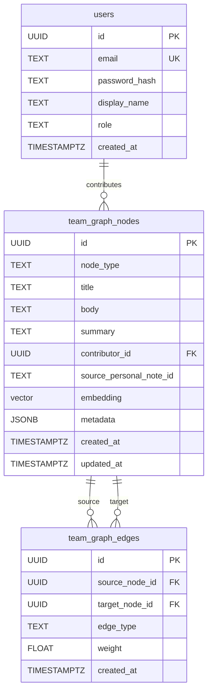

# Trellis Seed Data Analysis

> [!NOTE]
> All information sourced from the vault wiki and current codebase. References linked throughout.

---

## TL;DR

**The seed system is already fully implemented.** You don't need to build anything new — just run it. There are two seeding layers:

| Layer | Where | What it seeds | Trigger |
|---|---|---|---|
| **Backend** (server-side) | [seed.ts](file:///c:/Users/porte/CODE/trellis/apps/api/src/seed/seed.ts) | 3 demo users + 20 team graph insights + entity nodes + edges + embeddings | `POST /api/seed` or `npm run seed` |
| **Frontend** (client-side) | [seedPersonal.ts](file:///c:/Users/porte/CODE/trellis/apps/web/src/lib/seedPersonal.ts) | 6 personal notes into IndexedDB for the Lawyer account | Auto-runs on lawyer login |

---

## 1. Demo Accounts (Authentication)

**Yes, demo accounts are already defined.** Three users, all with password `demo`, bcrypt-hashed at 10 rounds:

| Email | Password | Display Name | Role | Purpose |
|---|---|---|---|---|
| `litigator@acme.law` | `demo` | Ana Mendoza | `lawyer` | Primary demo persona — captures notes, sees personal graph |
| `lead@acme.law` | `demo` | Carlos Reyes | `practice_group_lead` | Validator persona — same access as Lawyer in MVP |
| `admin@acme.law` | `demo` | Diana Santos | `knowledge_admin` | Exists in schema; admin dashboard is V1 |

> [!IMPORTANT]
> These are the **only** accounts needed for the MVP. No signup flow, no tenant management. The firm is hard-coded as "Acme Litigation Partners" — a fictional commercial litigation practice group.

**Auth flow** ([auth.ts](file:///c:/Users/porte/CODE/trellis/apps/api/src/routes/auth.ts)):
- `POST /api/auth/login` — validates email + password → returns JWT + user object
- `POST /api/auth/logout` — stateless (client drops token)
- `GET /api/me` — returns current user from JWT (requires `auth` middleware)

**You do NOT need to create any additional auth infrastructure.** The demo accounts are seeded by the backend seed script.

---

## 2. Backend Seed: Team Graph

Source: [seed.ts](file:///c:/Users/porte/CODE/trellis/apps/api/src/seed/seed.ts) + [insights.ts](file:///c:/Users/porte/CODE/trellis/apps/api/src/seed/insights.ts)

### What gets seeded

1. **3 users** (see table above)
2. **20 published insight nodes** with real embeddings (`text-embedding-004`, 768 dim)
3. **Entity nodes** — extracted from insight entities, deduplicated case-insensitively on `(node_type, LOWER(title))`
4. **Edges** — `mentions` relationships connecting insights to their entities

### Insight categories (20 total)

| Category | Count | Key topics |
|---|---|---|
| Judge tendencies | 5 | Pre-trial deadlines, mediation preferences, expert testimony scope, TAR acceptance, jurisdictional challenges |
| Opposing counsel patterns | 3 | Late document dumps, speaking objections, labor settlement tactics |
| Motion practice | 4 | Summary judgment with affidavits, motions in limine, demurrer timing, injunctive relief |
| **Expert witness handling** | **3** | **Counsel-supplied assumptions, Daubert-style challenges, rebuttal strategy** ← canonical demo query targets |
| Settlement dynamics | 3 | Early mediation, post-ruling leverage, structured proposals |
| Procedural lessons | 2 | Verified pleading deficiencies, Metro Manila local court practice |

### Seed voice

From [acme-seed-voice-tone.md](file:///c:/Users/porte/CODE/trellis/vault/questions/acme-seed-voice-tone.md):

> **Conclusory with brief narrative justification, 2–3 sentences each.** The voice is a senior partner dictating a quick note — a one-line conclusion, followed by a sentence or two of justification or context.

### Content jurisdiction

**Philippine laws, articles, and previous cases** — so the demo firm operates in PH litigation context and the canonical demo query produces strong results.

### Canonical demo query

> *"What has our firm learned about cross-examining expert witnesses on damages calculations?"*

This query targets the 3 expert witness insights. The seed is designed so **2–3 backup queries also produce strong answers** (e.g., about summary judgment strategy, settlement timing).

---

## 3. Frontend Seed: Personal Notes

Source: [seedPersonal.ts](file:///c:/Users/porte/CODE/trellis/apps/web/src/lib/seedPersonal.ts)

**6 personal notes** seeded into IndexedDB for `litigator@acme.law` on first login:

| Title | Classification | Privileged? |
|---|---|---|
| Judge Reyes — cross-examination latitude on expert testimony | observation | No |
| Damages calculation cross — Garcia & Partners expert pattern | strategy | **Yes** |
| Motion practice — RTC Makati Branch 147 under Judge Soriano | observation | No |
| Lesson learned — Dela Cruz v. Multinational Corp timeline failure | lesson_learned | **Yes** |
| Opposing counsel — Atty. Bautista (Tan & Reyes) patterns | observation | No |
| Settlement dynamics — commercial disputes above PHP 50M | strategy | **Yes** |

- The first two notes directly support the canonical demo query
- 3 of 6 are marked `isPrivileged: true` — demonstrates the redaction pipeline when published
- Auto-runs on lawyer login (wired in `LoginView.tsx`)
- **Idempotent**: skips if IndexedDB already has notes

---

## 4. How to Run the Seed

### Prerequisites

1. **Postgres with pgvector** running (Docker):
   ```
   docker compose -f infra/docker-compose.yml up -d
   ```

2. **Schema applied**:
   ```
   npm run schema  (or: npx ts-node apps/api/src/db/runSchema.ts)
   ```

3. **Environment variables** set in `apps/api/.env` (copy from [.env.example](file:///c:/Users/porte/CODE/trellis/apps/api/.env.example)):
   - `DATABASE_URL` — Postgres connection string
   - `GEMINI_API_KEY` — **required** for `text-embedding-004` embeddings at seed time
   - `JWT_SECRET` — for auth tokens

### Run the seed

**Option A: HTTP endpoint** (dev only, guarded by `NODE_ENV !== 'production'`):
```bash
curl -X POST http://localhost:3000/api/seed
```

**Option B: Direct script**:
```bash
npm run seed   # if configured in package.json
# or
npx ts-node apps/api/src/seed/seed.ts
```

### Personal notes seed

No manual step needed. When you log in as `litigator@acme.law` on the frontend, `seedPersonalNotes()` runs automatically and populates IndexedDB.

---

## 5. Database Schema

Source: [schema.sql](file:///c:/Users/porte/CODE/trellis/apps/api/src/db/schema.sql)



---

## 6. Summary: What's Built vs. What You Need To Do

| Item | Status | Notes |
|---|---|---|
| Demo user accounts (3) | ✅ Built | Seeded by `seed.ts` |
| Auth login/logout/me | ✅ Built | JWT-based, stateless |
| Team graph insights (20) | ✅ Built | PH law context, all categories covered |
| Entity node extraction + dedup | ✅ Built | Case-insensitive dedup |
| Embedding generation at seed time | ✅ Built | Requires `GEMINI_API_KEY` |
| Personal notes (6) | ✅ Built | Auto-seeds on lawyer login |
| Seed API endpoint | ✅ Built | `POST /api/seed` (dev only) |
| Schema migration script | ✅ Built | `runSchema.ts` |
| Docker compose for pgvector | ✅ Built | `infra/docker-compose.yml` |
| Signup/registration flow | ❌ Not needed | MVP is hard-coded demo accounts only |
| Additional demo accounts | ❌ Not needed | 3 accounts cover all MVP roles |
| Tenant management | ❌ Not needed | Single hard-coded firm (Acme) |

> [!TIP]
> The entire seeding pipeline is **idempotent** — both backend and frontend seeds check for existing data before inserting. Safe to call multiple times.
