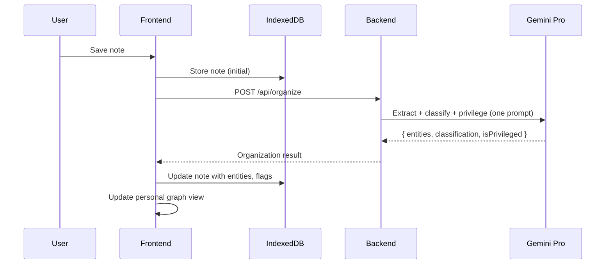
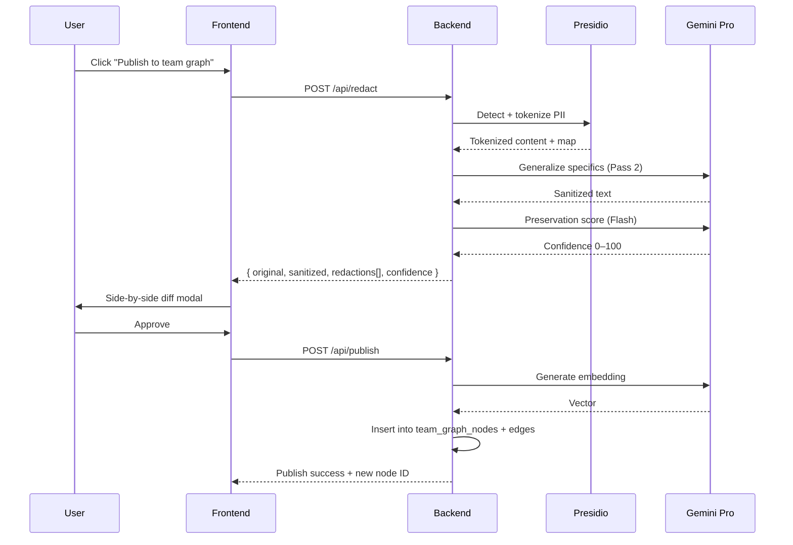
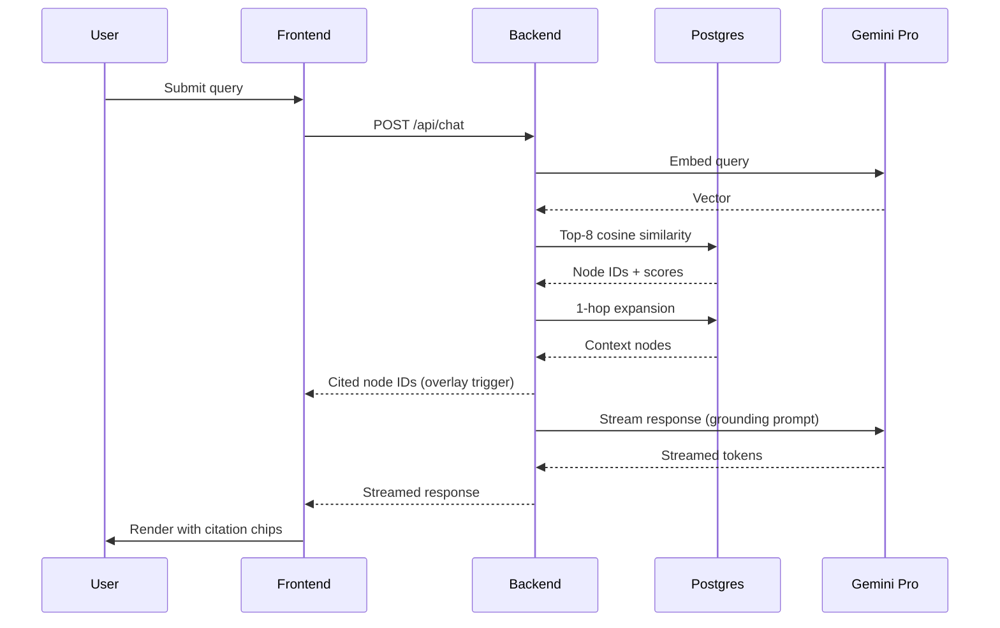

# Trellis AI pipelines

The three AI pipelines that make [[trellis|Trellis]] more than a notes app. All three depend on [[gemini]] (with [[whisper]] for audio and [[microsoft-presidio]] for redaction Pass 1).

## The three pipelines

| Pipeline | Trigger | Output |
|---|---|---|
| [[auto-organization-pipeline]] | Note saved | Entities, classification, privilege flag |
| [[redaction-pipeline]] | Lawyer clicks Publish | Sanitized version + redaction map + preservation score |
| [[rag-query-pipeline]] | Lawyer submits chat query | Streamed answer with inline citations |

## Auto-organization (after every note save)

Single structured-output Gemini Pro call returns `{ entities, classification, isPrivileged }` in under 5 seconds. Frontend updates the personal graph and renders entity chips on the note. See [[auto-organization-pipeline]] for the full spec.

## Redaction (on publish)

Two-pass MVP: [[microsoft-presidio|Presidio]] tokenization → Gemini generalization → preservation score (Flash). The frontend renders a side-by-side diff modal with hoverable connecting curves between matched redaction pairs. On approval, the sanitized version is embedded and inserted into the team graph.

See [[redaction-pipeline]] for the full spec including V1 four-pass.

## RAG query (on chat submit)

Embed query → top-8 cosine similarity in [[postgres-pgvector]] → 1-hop graph expansion → filter > 0.55 → stream Gemini Pro with grounding prompt. In parallel, frontend triggers [[query-overlay-animation]] using the returned cited node IDs.

See [[rag-query-pipeline]] for retrieval thresholds, confidence buckets, and refusal rules.

## Latency budget

- Auto-organization: **under 5 seconds**.
- Redaction: **two passes complete within 5 seconds**; modal opens within 3.
- Chat: **streaming begins within 3 seconds**; cited node IDs arrive in 1–2.

## Cost (MVP)

Total Gemini + Whisper for the hackathon window: **$25–$60** (covered by GCP $300 free credit). (see [[trellis-project-architecture]] §12)

## Sources

- [[trellis-project-architecture]]
- [[trellis-product-requirements]]
